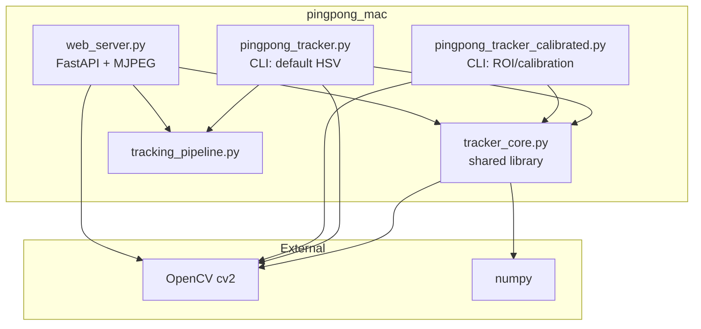
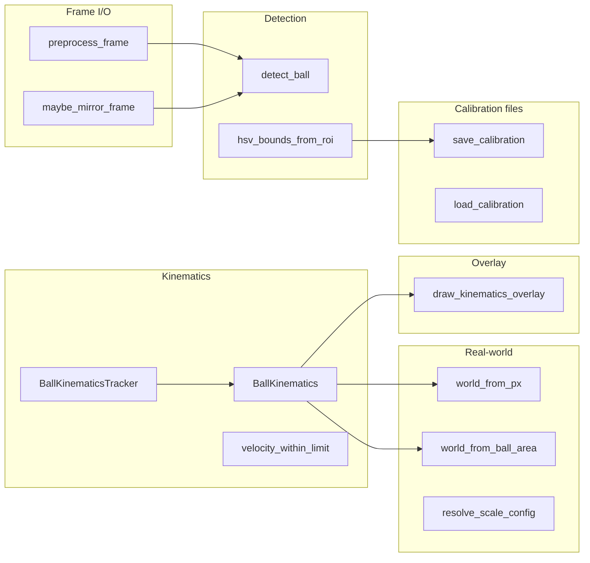
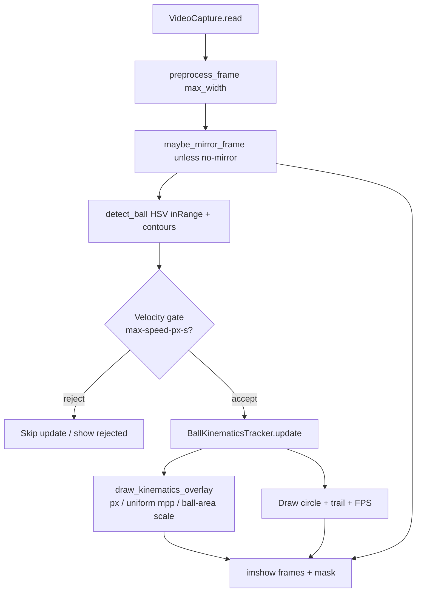
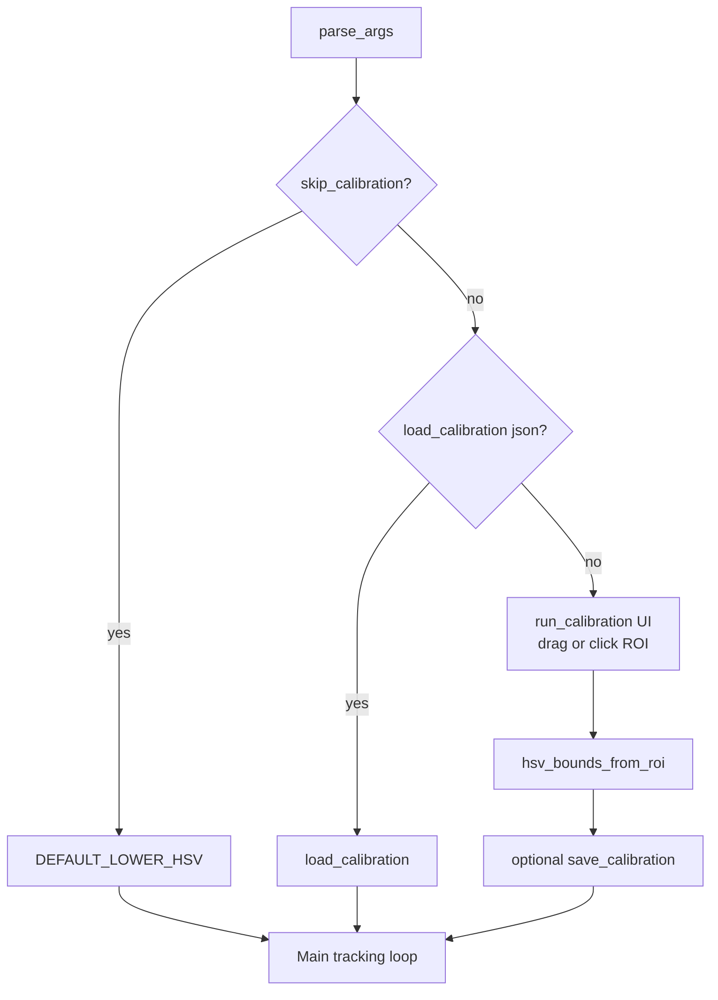

# Ping Pong Tracker — codebase diagrams

These diagrams use [Mermaid](https://mermaid.js.org/). They render in GitHub, many IDEs (including Cursor), and Markdown previewers.

---

## 1. Module layout (dependencies)

- **`tracker_core`**: detection, masks, kinematics, scaling, argparse helpers, calibration math.
- **`tracking_pipeline`**: shared per-frame overlay + kinematics (CLI + web).
- **`pingpong_tracker`**: OpenCV windows; fixed white-ball HSV.
- **`pingpong_tracker_calibrated`**: calibration UI + same tracking loop; loads/saves JSON HSV.
- **`web_server`**: browser UI at `/`, MJPEG at `/stream`, JSON `/api/status`, POST `/api/reset-origin`.

---

## 2. What lives in `tracker_core.py` (logical blocks)

---

## 3. Per-frame pipeline (both trackers)

---

## 4. `pingpong_tracker_calibrated.py` only (startup)

---

## 5. Data artifacts

| File | Role |
|------|------|
| `requirements.txt` | `opencv-python`, `numpy` |
| `README.md` | Usage and flags |
| User `*.json` (optional) | `lower_hsv` / `upper_hsv` from calibration |

---

*Generated for the pingpong_mac project; edit this file if you add modules.*
